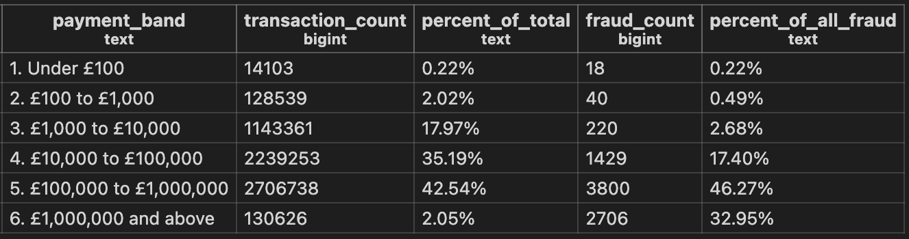

# Payment Fraud Concentration 

## Overview

This project uses SQL to analyse over 6.3 million payment transactions, segmenting them into value bands to identify where fraud concentrates by payment size. 
It was built entirely in PostgreSQL to demonstrate querying and summarising data at a scale spreadsheet tools like Excel cannot practically handle, a core skill for payment and risk analyst roles in financial services.

&nbsp;

## Why This Project Matters

aa

&nbsp;

## Dataset

The data comes from PaySim, a synthetic financial dataset available on Kaggle that simulates money transactions based on real transaction logs. 
It contains 6,362,620 records across eleven columns, including transaction type, amount, sender and receiver account identifiers, account balances before and after each transaction, and two fraud indicators.

&nbsp;

## Methodology

**1) Set Up the Database:** 
The dataset was loaded into a PostgreSQL database, with a table structured to match the eleven columns in the source file.

**2) Import the Data:** 
All 6.3 million transactions were imported directly into PostgreSQL using the COPY command, avoiding the performance limits of spreadsheet tools at this scale.

**3) Segment and Analyse:** 
Transactions were grouped into six value bands, from under £100 to over £1,000,000. 
SQL window functions were used to calculate each band's share of total transaction volume alongside its share of all fraudulent transactions, both within a single query. 
The full query is available in this repository.

&nbsp;

**Table 1: Transaction Volume and Fraud Distribution by Payment Band**

Groups every transaction into one of six value bands to analyze risk concentration. 
It displays the total transaction count and percentage share for each band, alongside the corresponding number of fraudulent cases and their overall share of total fraud.

&nbsp;

Transactions over £1,000,000 account for just 2% of total transaction volume, yet make up 33% of all fraudulent transactions in the dataset, over sixteen times their share of volume. 
This concentration of risk in a small number of high value transactions is the kind of pattern a risk team would want surfaced early, rather than treating every payment band as equally risky.

During the analysis, 287 of the 8,213 total fraud cases were found to sit at an identical value of exactly £10,000,000, a ceiling built into how the dataset simulates fraud rather than a genuine pattern in account behaviour. 
Catching and explaining anomalies like this before they skew a result is as much a part of the analysis as the headline finding.
